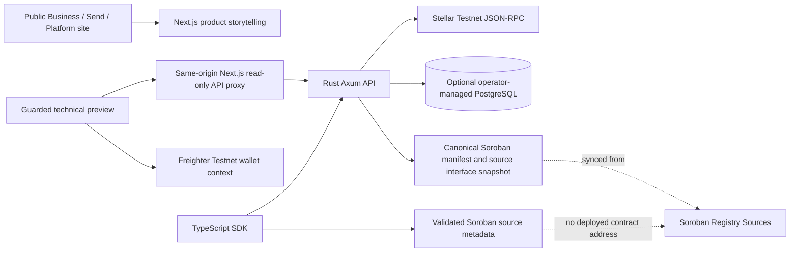

# StealthBridge: Four-Repository Integration Topology

**Scope:** A coherent Stellar Testnet integration between `stealthbridge-frontend`, `stealthbridge-backend`, `stealthbridge-contracts` and `stealthbridge-sdk`. This document describes implemented wiring and the hard gates remaining before private transfers, regulated payouts or real-money settlement. It does not claim live contracts, bank relationships or transaction completion.

## October 2026 implementation update

The detailed and current north-star reference is [Platform Vision and Architecture](PLATFORM-VISION-AND-ARCHITECTURE.md). This integration topology remains focused on transport and cross-repository ownership.

- **Database:** the managed Neon PostgreSQL schema has been migrated, but per-deployment runtime database reachability and recovery drills still need independent acceptance.
- **Wallet:** the technical preview supports consented Freighter public-address connection and a distinct local watch-only Stellar G-address; no signing or identity proof.
- **Soroban:** the checked-in source inventory now contains **three** contracts: corridor registry, policy registry and a read-only cross-registry governance gate. Their reproducible WASM is tested, but the Testnet deployment manifest remains `not-deployed`.
- **Runtime:** public RPC observation, corridor discovery and explicit unavailable states exist. SDK and frontend validate the contract source inventory and reject unsupported payment-capability claims.
- **Financial features:** not operational. No confidential transfer, issuer-backed stablecoin, real FX quote, partner payout or automated transaction signer should be represented as shipped.

### Ownership rule

The contract repository owns source ABI and future deployment attestations; the backend owns HTTP/OpenAPI and server-side secrets; SDK owns typed validation and consumer compatibility; frontend owns consent, presentation, accessibility and the GET-only browser proxy. Do not use an unverified wallet address, registry flag, database corridor row, CI badge or deployment-ready build to infer a real payment rail.

## Architecture

Public marketing has **no payment execution**, source-code CTAs, or dependence on Stellar RPC. The technical preview is opt-in; it exposes only read-only backend data and wallet network state.

## Current API contract

| API route | Backend source | Frontend / SDK mapping | Behavior when unavailable |
|---|---|---|---|
| `GET /health` | Axum liveness | SDK `health` | 200 process alive, not chain readiness |
| `GET /ready` | Stellar RPC + PostgreSQL readiness | Preview status, SDK `readiness` | 503 degraded; payments always disabled |
| `GET /v1/network` | Live Testnet RPC, passphrase verified | Preview live ledger, SDK `network` | 502 on invalid/missing chain response |
| `GET /v1/capabilities` | Explicit server flags | Both products, SDK `capabilities` | No live payment/privacy flags assumed |
| `GET /v1/corridors/page` | Enabled database corridors, keyset pagination | Preview search, SDK `corridorsPage` / `scanCorridors` | 503 without DB; no seeded partners |
| `GET /v1/corridors/{id}` | Parameterized enabled-corridor lookup | SDK `corridor` | 404 unknown/disabled; 503 DB |
| `GET /v1/observer` | Last persisted read-only ledger checkpoint | Preview, SDK `observerHead` | 404 when never observed; may be stale |
| `GET /v1/transactions/{hash}` | Public Testnet transaction status | SDK `transaction`, explorer | No raw XDR or payout claims |
| `GET /v1/contracts` | Canonical undeployed manifest + checked source methods | Preview and SDK `contracts` | Fail closed on an unverified deployment claim |
| `POST /v1/settlements` | Explicitly disabled handler | No public payment CTA | 501; no chain submission |

## Canonical contract data

The Soroban repository owns `deployments/testnet/manifest.json` and `integrations/public-soroban-interface.v1.json`. The manifest currently declares **no verified deployments**. The interface file lists exact public read methods in `corridor-registry` and `policy-registry`. Its CI verifies method names against the actual Rust source. The backend mirrors these files with a cross-repository CI check and refuses unexpected deployed claims. The SDK validates the backend output and refuses to resolve contract addresses without independent on-chain attestation. Source ABI definitions do not make contracts deployed or usable.

## Wallet and private-payment separation

Freighter is a **wallet-owned address/network context**, not an authenticated StealthBridge tenant session. The technical preview confirms the exact Testnet passphrase from both Freighter and the read-only backend and rechecks wallet state when the browser regains focus. It does not request signing, submit transactions, collect seeds or expose a cryptographic proof. Later tenant sessions require a domain/nonce/network-bound challenge, replay-safe persistence, verified signatures and tenant-scoped authorization; wallet connection alone cannot satisfy any of these.

Confidential token amount privacy for institutional transfers and relationship privacy for consumer remittances are **different** objectives. Neither is asserted as functioning on-chain in the current release. Policy/corridor contract flags are not KYC attestation, financial eligibility or payout provider commitments.

## Staging deployment sequence

1. **Frontend:** Keep `stealthbridge.vercel.app` in default `landing` mode, with public Business/Send/Platform storytelling only.
2. **Backend preview:** Import `stealthbridge-labs/stealthbridge-backend` to a Vercel project using the official Rust Functions/Axum runtime and checked-in `api/axum.rs` + `vercel.json`. Set `STELLAR_RPC_URL` to an operator-approved HTTPS Stellar **Testnet** RPC endpoint. Never supply production signing keys or live customer data. The API must return its actual `/health`, `/v1/network`, `/v1/capabilities` and `/v1/contracts` responses before being considered reachable.
3. **Optional database:** Provide a restricted PostgreSQL URL, apply checked SQL migrations as a separate controlled operation, and run contract/tenant/inbox integration tests. An unconfigured database legitimately yields 503 for corridors and readiness; never seed fake partner corridors.
4. **Technical preview frontend:** Use a separate protected Vercel deployment/project, not the public product domain. Configure `STEALTHBRIDGE_SITE_MODE=preview` and `STEALTHBRIDGE_API_URL=https://verified-backend-host`. The Next.js API proxy maintains an explicit GET allowlist and caps untrusted upstream responses.
5. **SDK:** Use `StealthBridgeClient({network:'testnet',apiBaseUrl:'https://verified-backend-host'})`; confirm `network()`, `capabilities()`, `contracts()`, `readiness()` and optionally `corridorsPage()` match actual live server responses. Package is not independently deployed as a website or published automatically.
6. **Soroban:** Do **not** deploy just to satisfy a UI demonstration. A reviewed Testnet deployment needs authorized keys, build provenance, independently verified contract IDs/code hashes, ABI parity, Soroban budget/storage tests, deterministic network passphrase checks, wallet permission UX and a repeatable rollback plan.
7. **Real financial operations:** Require authenticated organizations, immutable approval records, valid signed transaction/authz, privacy proof validation, regulated issuer/fiat partners, ledger and off-chain reconciliation, incident response, external audits and legal approval. Only then can capability flags or payment routes change.

## Environment ownership

| Input | Owner | Required for |
|---|---|---|
| `STEALTHBRIDGE_SITE_MODE` | Frontend/Vercel | Separating public landing from preview |
| `STEALTHBRIDGE_API_URL` | Technical preview Next.js server | Same-origin proxy to deployed backend |
| `STELLAR_RPC_URL` | Backend deployment | Verified Testnet RPC reads |
| `DATABASE_URL` | Backend operator | Corridor catalog, ledger checkpoint and tenant storage |
| `STEALTHBRIDGE_ENABLE_LEDGER_OBSERVER` | Persistent backend worker only | Opt-in ledger checkpoint polling; not for serverless |
| Authorized Testnet signer (not stored here) | Contract deployment authority | Later approved Soroban deploy/upgrade |

Never commit private keys, production database credentials, payout partner tokens, wallet seed phrases, customer KYC documents or confidential payment witnesses. Vercel backend Function instances cannot substitute for an always-on ledger observer; operate the observer on a separately managed persistent worker.

## Verification

Each repository has its own CI. Backend CI additionally checks its contract data snapshots against the contracts repo; contracts CI verifies public source method inventory; SDK CI runs typed API, ESM, browser and Next.js package-consumer tests; frontend CI checks production marketing behavior including no codebase redirects, mobile/desktop UI and keyboard/motion behavior. A successful build does not establish an on-chain transfer, deployed contract or live partner.

**Next owner decisions:** Vercel team write access for a backend preview; managed Postgres provider and database scope; private staging domain/access policy; approved Testnet network/RPC; whether the team is ready for a separately reviewed Testnet governance deployment. Do not treat any unresolved decision as completed.
