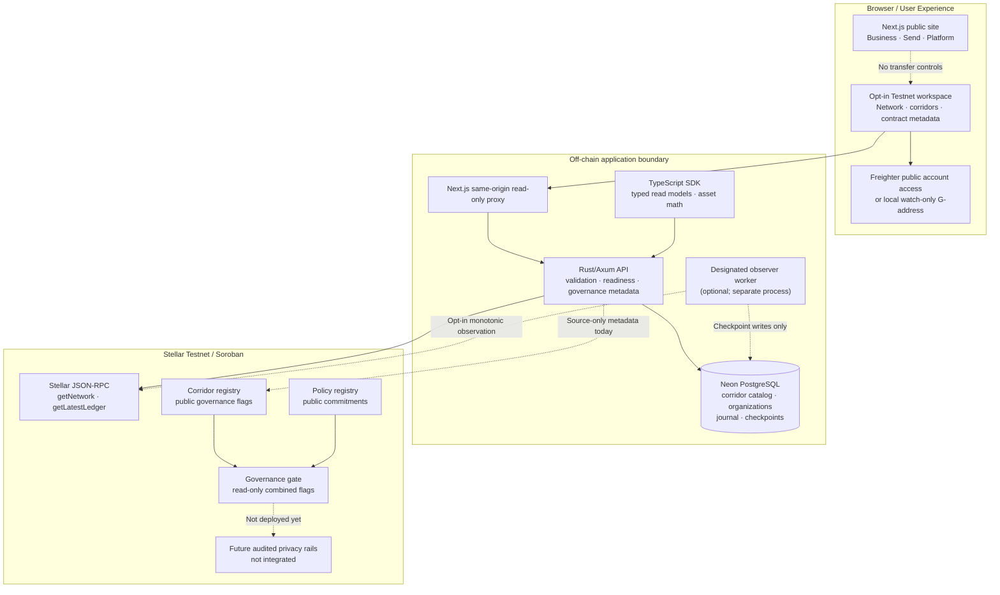

# StealthBridge — Platform Vision, Architecture, and Delivery Plan

> **Engineering reference · October 2026 · Stellar Testnet-first**
>
> This document describes the intended system **and labels what is currently implemented**. It is not an announcement of live confidential payments, audited privacy, licensed fiat payout, Mainnet availability, or a deployed Soroban contract.

## North star

StealthBridge is being developed as a modular, privacy-conscious payment platform for two distinct journeys:

- **StealthBridge Business:** treasury and payment operations for approved institutions. The objective is confidentiality of values and commercially sensitive information **with appropriate counterparty identification, approval, audit, and compliance boundaries**.
- **StealthBridge Send:** consumer-facing cross-border value movement where relationship privacy may eventually be supported by a separately verified Stellar privacy protocol. Deposit, withdrawal, on/off-ramp, recipient communications, and compliance edges can still disclose metadata.
- **StealthBridge Platform:** an API, SDK, event/ledger observability and governance layer that keeps product experiences consistent, but does not conflate wallet access, liquidity, policy flags, payment proof verification, and actual settlement.

Our direction is **evidence-driven interoperability** rather than an all-powerful contract or a visual-only payment demo.

## System map

**Important:** arrows to registry sources are architectural intent, **not deployed contract invocations**. The three Rust/Soroban crates compile and are tested locally; the checked-in Testnet manifest still says `not-deployed`.

## Ownership and integration contracts

| Owner | What exists now | Next integration / review gate |
| --- | --- | --- |
| [Frontend](https://github.com/stealthbridge-labs/stealthbridge-frontend) | Next.js public experience and protected technical preview, Testnet read-only proxy, Freighter public-account connection, watch-only address, disabled transfer UX | Runtime E2E acceptance, pinned shared SDK consumption, authenticated organization flows, independently reviewed wallet signing UX |
| [Backend](https://github.com/stealthbridge-labs/stealthbridge-backend) | Rust/Axum Testnet RPC reads, Neon schema and controlled migrations, real enabled-corridor queries, read-only transaction status, journal and authorization primitives | Verified deployment connectivity, dedicated observer, challenge authentication, tenant authorization, provider sandbox and reconciliation |
| [SDK](https://github.com/stealthbridge-labs/stealthbridge-sdk) | Private ESM TypeScript package, read-only typed client, freshness checks, exact amount arithmetic, G-address validation, source-interface fail-closed validation | Versioned package release, generated OpenAPI types, on-chain read adapter gated by a verified manifest, wallet-signer interfaces after review |
| [Contracts](https://github.com/stealthbridge-labs/stealthbridge-contracts) | Three Soroban source contracts (corridor, policy, governance gate), authorization and pause tests, reproducible WASM/ABI evidence, Testnet deployment preflight | Operator-signed Testnet deployment, independent bytecode/admin/dependency verification, privacy-rail feasibility and audit |
| [Organization](https://github.com/stealthbridge-labs/.github) | Shared contribution, security and brand governance | Unified release checklist, versioned architecture decisions, public changelog and disclosure policy |

**Single-source-of-truth rules:** contract source and source-interface JSON belong to the contracts repository; deployment and manifest truth must be independently attested; backend OpenAPI defines the HTTP boundary; SDK validates and exposes typed consuming methods; frontend cannot enable a capability solely because a Boolean, wallet connection, or website button exists.

## What is real vs. planned

| Capability | Current evidence | Not yet established |
| --- | --- | --- |
| Stellar Testnet observation | RPC client, network-passphrase validation, ledger freshness checks, automated tests | Independently accessible production runtime acceptance for every environment and resilient chain indexing |
| Managed database | Neon-backed PostgreSQL schema provisioned and migrated; versioned SQLx migrations, corridor query code | Public operational service-level assurance, backups/recovery drills, active commercial corridors |
| Corridors | Operator CLI stores **disabled** candidates; backend reads **enabled** records only | Verified real issuers, privacy compatibility, active providers, executable price/FX quotes and payout availability |
| Wallets | User-initiated Freighter public-key access, wrong-network handling, local watch-only addresses and checksum checks | Signed login challenge, wallet account authority for an organization, reviewed transaction-signing workflow |
| Soroban | Three compiled source contracts, local cross-contract tests, byte-for-byte reproducible build evidence | Actual verified contract IDs, signed Testnet deploy transactions, independent admin/binding/bytecode attestation |
| Financial flows | Internal settlement state machine and journal; HTTP settlement command explicitly disabled | Privacy witnesses/provers, audit, real asset transfer, exchange, banking/fiat payout, compliance sign-off |
| Frontend product | Public landing and technical preview builds with CI/browser checks | Production financial dashboard, authenticated workflows, receipts, live transfer success |

CI and a Vercel `READY` deployment are **engineering signals, not proof of payment functionality**.

## Data and trust boundaries

1. **Browser / wallet:** private keys and recovery material must remain with the wallet. Watching a public G-address is neither signing nor authentication. Connecting Freighter only grants read access to a public account; it must never authorize a transaction implicitly.
2. **Next.js boundary:** the public marketing site does not depend on chain availability. The guarded preview uses an allowlisted, GET-only, same-origin proxy; remote redirects are rejected.
3. **Rust API:** validate request parameters, Testnet passphrase, ledger age, response size, connection timeouts, and upstream metadata. Refuse unsupported capability/deployed-contract claims.
4. **PostgreSQL:** keep credentials server-side, enforce TLS for remote connections, use per-function bounded pools, version SQLx migrations and maintain tenant isolation. An internal settlement journal is not a public payment API.
5. **Soroban:** on-chain registry flags and public policy commitments are public governance configuration. Each privileged write needs `require_auth()`; emergency pauses reject new activations. The governance gate combines **public flags only**, not permission to move funds.
6. **Privacy and compliance:** define exactly which party, amount, recipient, note, event, issuer privilege, and off-ramp metadata are hidden or disclosed. Do not claim zero knowledge, irreversibility, liquidity, or regulatory clearance without independent evidence.
7. **Providers and operations:** future authenticated callbacks require replay protection, idempotency, signature checks, reconciled payout evidence, and incident runbooks. No partner name or rate should be generated as sample production data.

## Target product journeys

**Business:** organization selection → verified member session → corridor and issuer eligibility → signed/expiring quote → separation-of-duties approvals → reviewed wallet authorization → audited privacy-rail invocation → chain finality → independently reconciled fiat/asset settlement → immutable receipts and exception recovery.

**Send:** destination/asset eligibility → transparent quote and fees → recipient/privacy disclosure → opt-in wallet connection → reviewed funding/authorization → privacy proof/note lifecycle (where actually supported) → destination redemption/off-ramp → payout status and recovery. Unsupported steps must visibly remain unavailable, never become simulated success.

Neither journey is implemented end to end today. Both share observability and policy primitives, but their confidentiality models and consent requirements differ.

## Delivery horizons and acceptance evidence

### Horizon 1 — Working, observable Testnet foundation
- Verifiable HTTPS API and database readiness from an authorized observer; migration integrity, real ledger age, actual empty/approved corridor catalog.
- Shared API/SDK types, trace correlation, browser error states, mobile and keyboard tests.
- One deployment record per environment with network, source revision, runtime probes, known issues, and rollback procedure.
- **Exit:** cross-service smoke evidence; no fake records; no financial capabilities enabled.

### Horizon 2 — Soroban governance on Testnet
- Dedicated operator-controlled Testnet public account, reviewed deployment transactions, versioned three-contract manifest.
- Independent SHA-256 verification of on-chain WASM, constructor-bound registry addresses, admin and pause state, TTL and deployment transactions.
- Safe backend on-chain **read** adapter and SDK types; frontend shows verified governance read evidence but no transfers.
- **Exit:** independent chain attestation, negative tests, owner approval, rollback/recovery documented.

### Horizon 3 — Identity and financial workflow foundations
- Signed, origin- and network-bound wallet challenge, nonce replay defense, tenant membership, RBAC and audit.
- Authenticated draft/approval journal, idempotency, durable outbox/inbox, quote expiry and actual partner sandbox interfaces.
- Failure and concurrency testing; explicit security and compliance reviews.
- **Exit:** trustworthy non-value-moving orchestration and a complete, reviewable signing UX in Testnet-only environments.

### Horizon 4 — Independently verified privacy and settlement
- Choose and pin *actual* Stellar Confidential Tokens and/or Private Payments integration versions; establish threat models, issuer controls and privacy boundaries.
- Cryptographic verifier/prover vectors, note recovery, ledger and fee simulations, failed/duplicate spend tests, partner payout/reconciliation trials.
- Audit, legal/compliance and operator sign-offs **before** enabling any asset-moving feature.
- **Exit:** evidenced Testnet end-to-end flow with bounded risk; Mainnet is a later, separate decision.

These are **dependencies and quality gates, not delivery-date promises**.

## Proposed architecture decisions (ADRs)

Maintain an ADR for each security-relevant change: **wallet signature and session format; three-contract manifest v2; contract upgrade/admin control; privacy primitive selection; asset and issuer attestations; quote/corridor eligibility; external provider callback validation; worker/indexer topology; monitoring/data retention; package version compatibility; production incident/rollback procedure**.

Each ADR should include alternatives, threat boundaries, evidence needed, affected repositories and rollback plan.

## How contributors should use these documents

Start with this organization-wide plan, then the repository-specific `README.md`, `ROADMAP.md`, and `docs/ARCHITECTURE-AND-DELIVERY.md`. Build changes in the owning repo first; update OpenAPI/ABI and consumers in a coordinated sequence. Require green CI **and** environment-specific verification before calling a feature complete. Never paste Neon/Alchemy credentials, wallet seeds, bank tokens or proof witnesses in public files.

- [Architecture topology](INTEGRATION-TOPOLOGY.md)
- [Organization overview](../profile/README.md)
- [Contracts deployment ceremony](https://github.com/stealthbridge-labs/stealthbridge-contracts/blob/main/deployments/testnet/OPERATOR-DEPLOYMENT-RUNBOOK.md)
- [Backend managed PostgreSQL](https://github.com/stealthbridge-labs/stealthbridge-backend/blob/main/docs/MANAGED-POSTGRES.md)
- [Frontend wallet consent model](https://github.com/stealthbridge-labs/stealthbridge-frontend/blob/main/docs/WALLET-INTEGRATION.md)
