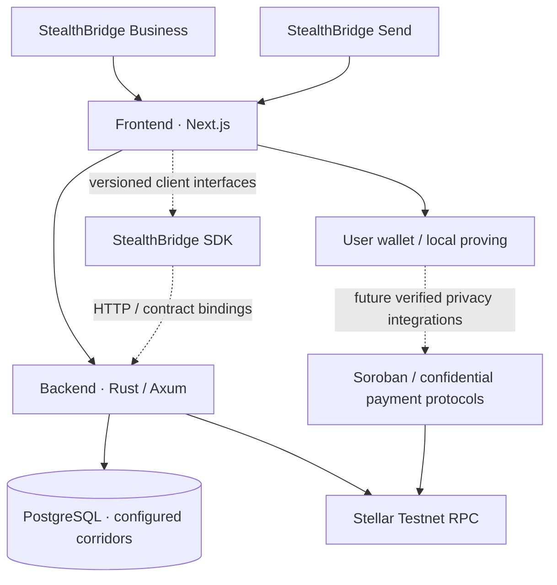

 

### Confidential payments. Without borders.

**Building the infrastructure for a more private, interoperable world of cross-border payments on Stellar.**

[Explore our repositories](https://github.com/orgs/stealthbridge-labs/repositories) · [How to contribute](https://github.com/stealthbridge-labs/.github/blob/main/CONTRIBUTING.md) · [Engineering roadmap](https://github.com/stealthbridge-labs/stealthbridge-contracts/blob/main/docs/ROADMAP-v0.2.md) · [View open issues](https://github.com/search?q=org%3Astealthbridge-labs+is%3Aissue+is%3Aopen&type=issues)

---

## Why StealthBridge?

Sending value across borders should not require broadcasting every detail of a payment to the world.

**StealthBridge** is an emerging, modular platform exploring how financial institutions and individuals can settle across borders while reducing unnecessary disclosure of financial information. Our goal is to bring together **privacy-preserving payments, responsible financial controls, and developer-friendly infrastructure**—without pretending that cryptography alone solves foreign exchange, compliance, liquidity or cash-out.

We're building beyond a single remittance corridor: a foundation for multiple regions, asset issuers, institutions and payment providers. Each use case gets a clearly defined privacy model rather than a one-size-fits-all promise of anonymity.

### Three products. One connected ecosystem.

<table>
  <tr>
    <td width="33%" valign="top">
      <h3>🏦 StealthBridge Business</h3>
      
Confidential business-to-business settlement for payment providers, treasury teams and financial institutions.

      
<strong>Privacy objective:</strong> Conceal payment amounts and balances where the underlying confidential-token protocol supports it, while recognizing that institutional parties may be identifiable.

    </td>
    <td width="33%" valign="top">
      <h3>🌍 StealthBridge Send</h3>
      
A consumer-focused experience for cross-border remittances and recipient journeys.

      
<strong>Privacy objective:</strong> Protect values and payment relationships within supported shielded flows; public deposits, withdrawals and fiat-provider records can still reveal information.

    </td>
    <td width="34%" valign="top">
      <h3>🧩 StealthBridge Protocol</h3>
      
The underlying contracts, corridor orchestration, payment lifecycle, policy boundaries and SDK interfaces.

      
<strong>Developer objective:</strong> Provide reusable, versioned components for interoperating with Stellar and separately validated privacy primitives.

    </td>
  </tr>
</table>

## Our codebases

We intentionally keep applications, orchestration, contracts and public integration surfaces separate so each can evolve without forcing unrelated changes into a single repository.

| Repository | What you'll find | Status |
| :-- | :-- | :-- |
| **[stealthbridge-frontend](https://github.com/stealthbridge-labs/stealthbridge-frontend)** | Next.js 16 / TypeScript / Tailwind CSS / GSAP, Business & Send interfaces, Freighter wallet integration, live API integration | UI and read-only network integration |
| **[stealthbridge-backend](https://github.com/stealthbridge-labs/stealthbridge-backend)** | Rust / Axum, real Stellar Testnet RPC observations, PostgreSQL-backed corridor catalog, settlement state model, OpenAPI | Read-only API; payment actions disabled |
| **[stealthbridge-contracts](https://github.com/stealthbridge-labs/stealthbridge-contracts)** | Soroban Rust contract prototypes, confidential-payment research, protocol architecture, threat model and deployment plans | Registry prototype; no confidential-payment deployment |
| **[stealthbridge-sdk](https://github.com/stealthbridge-labs/stealthbridge-sdk)** | Typed TypeScript API client, network/corridor models and compatibility policies | Read-only client; no signing or transfers |

**Technical shape:**

**Important:** The privacy flows shown here are *target architecture*, not connected fund-moving implementations. Confidential Tokens and Stellar Private Payments have different properties and are being evaluated independently; we do not presume they compose into one atomic transfer.

## What we're engineering toward

- **Confidential stablecoin settlement** — investigate issuer-controlled confidential amounts, balance protection, access policies, selective disclosure, and redemption considerations.
- **Private remittances** — investigate shielded-transfer protocols, sender/receiver unlinkability, note security and recovery, and the realities of public fiat on/off-ramp edges.
- **Multi-corridor orchestration** — configure real assets and verified payment providers; track quotes, wallet authorization, blockchain finality and external payout independently.
- **Developer-first integration** — publish typed SDKs, versioned contract bindings and explicit capability checks.
- **Secure, scalable operations** — tenant isolation, idempotent workflows, replay-resistant policies, transaction reconciliation and observability without exposing confidential financial data.

We follow official [Stellar developer documentation](https://developers.stellar.org/docs) and [Stellar engineering skills](https://skills.stellar.org/), and study community projects such as [Tukar](https://github.com/PugarHuda/tukar) as prior art rather than describing established capabilities as our own.

## Where we are today

| Milestone | State |
| :-- | :-- |
| Independent application, backend, contract and SDK repositories | ✅ Established |
| Frontend Business/Send UI, testnet wallet connectivity, backend network reads | ✅ Code committed |
| Continuous integration for all four repositories | ✅ Build and test workflows |
| Reproducible confidential-token payments on Stellar Testnet | 🔬 Verification pending |
| Reproducible private-remittance transfer flow | 🔬 Verification pending |
| Authenticated payment orchestration, external FX and regulated fiat payouts | 🛠️ Planned |
| Mainnet, independent audit and real-value deployment | 🔒 Not available |

We are deliberately **not** seeding fake balances, fabricated transaction histories, arbitrary FX rates, invented partners or hardcoded “live” corridors. An unavailable integration must say so.

> [!CAUTION]
> **Engineering research / Stellar Testnet only.** StealthBridge does not currently offer a real-money transfer service or audited private settlement protocol. The current apps cannot execute confidential payments or fiat payouts. Do not send real funds, private keys, recovery phrases, ZK witnesses or personal KYC data to the project.

## Build with us

We welcome contributors across web engineering, Rust, Soroban security, developer tooling, protocol research, design and technical writing. We have started with **10 scoped GitHub issues** and acceptance criteria so new contributors can make meaningful, reviewable changes.

| Area | Good starting points |
| :-- | :-- |
| **Frontend and design** | [Accessible real-network UI](https://github.com/stealthbridge-labs/stealthbridge-frontend/issues/1) · [Freighter wallet UX](https://github.com/stealthbridge-labs/stealthbridge-frontend/issues/2) · [Real corridor discovery](https://github.com/stealthbridge-labs/stealthbridge-frontend/issues/3) |
| **Backend and reliability** | [Tenant-scoped settlement persistence](https://github.com/stealthbridge-labs/stealthbridge-backend/issues/1) · [Stellar ledger observation](https://github.com/stealthbridge-labs/stealthbridge-backend/issues/2) · [Organization authentication](https://github.com/stealthbridge-labs/stealthbridge-backend/issues/3) |
| **Soroban / cryptography** | [Registry authorization and TTL](https://github.com/stealthbridge-labs/stealthbridge-contracts/issues/1) · [Testnet privacy primitive research](https://github.com/stealthbridge-labs/stealthbridge-contracts/issues/2) |
| **SDK and integration** | [Generated API bindings](https://github.com/stealthbridge-labs/stealthbridge-sdk/issues/1) · [Wallet-owned privacy adapters](https://github.com/stealthbridge-labs/stealthbridge-sdk/issues/2) |

Read our [contributing guide](https://github.com/stealthbridge-labs/.github/blob/main/CONTRIBUTING.md), [community guidelines](https://github.com/stealthbridge-labs/.github/blob/main/CODE_OF_CONDUCT.md) and [security policy](https://github.com/stealthbridge-labs/.github/blob/main/SECURITY.md) before opening a PR.

Our documentation standard is simple: **be precise about what is implemented, deployed, verified and still proposed**. Tests and network evidence matter more than marketing claims.

## Open development & Drips

StealthBridge is being developed in public, with the long-term goal of supporting sustainable, community-led open-source development—including potential participation in [Drips](https://www.drips.network/). Contributor governance, repository licensing and funding setup are still being prepared; **no Drips funding account, distribution or mainnet payment service is implied by this page**.

For more detail, see the [architecture RFC](https://github.com/stealthbridge-labs/stealthbridge-contracts/blob/main/docs/RFC-0001-PLATFORM-ARCHITECTURE.md), [threat model](https://github.com/stealthbridge-labs/stealthbridge-contracts/blob/main/docs/THREAT-MODEL-v0.2.md), [privacy feasibility matrix](https://github.com/stealthbridge-labs/stealthbridge-contracts/blob/main/docs/PRIVACY-FEASIBILITY-MATRIX.md) and [roadmap](https://github.com/stealthbridge-labs/stealthbridge-contracts/blob/main/docs/ROADMAP-v0.2.md).

---

**Move value. Not exposure.**

**StealthBridge** · *Confidential payments. Without borders.*

[GitHub Organization](https://github.com/stealthbridge-labs) · [Repositories](https://github.com/orgs/stealthbridge-labs/repositories) · [Contribute](https://github.com/stealthbridge-labs/.github/blob/main/CONTRIBUTING.md)

