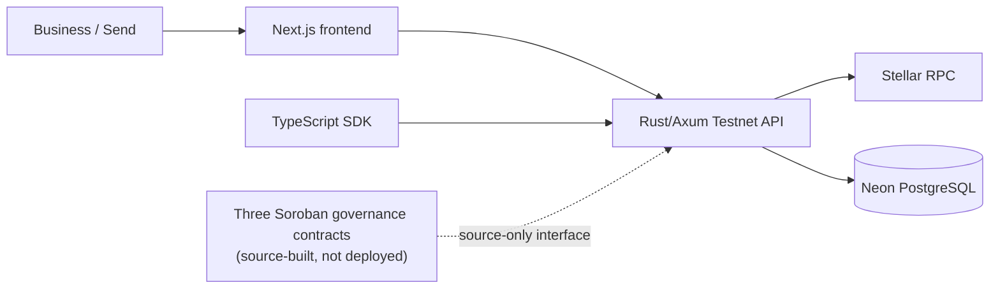

  

  **Confidential payments. Without borders.**

  Building the next generation of privacy-conscious cross-border payment experiences on Stellar.

  [Explore StealthBridge](https://stealthbridge.vercel.app/) · [Business](https://stealthbridge.vercel.app/business) · [Send](https://stealthbridge.vercel.app/send) · [Our platform](https://stealthbridge.vercel.app/platform)

---

## Why StealthBridge?

Moving value across borders should feel connected and straightforward, without revealing more financial information than necessary. We're building a modular platform that brings together **thoughtful privacy, dependable settlement infrastructure, and product experiences designed for real businesses and people**.

## What we're building

| | Product | Purpose |
| :-- | :-- | :-- |
| 🏦 | **[StealthBridge Business](https://stealthbridge.vercel.app/business)** | Confidential settlement experiences for treasury teams, payment businesses and institutions, with oversight and reconciliation in mind. |
| 🌍 | **[StealthBridge Send](https://stealthbridge.vercel.app/send)** | A more personal, transparent and privacy-conscious way to approach international remittances. |
| 🧩 | **[StealthBridge Platform](https://stealthbridge.vercel.app/platform)** | Shared infrastructure for asset and corridor discovery, settlement orchestration, governance and developer integrations. |

## The StealthBridge ecosystem

Four focused repositories, designed to move together:

| Repository | Focus |
| :-- | :-- |
| [**Frontend**](https://github.com/stealthbridge-labs/stealthbridge-frontend) | Next.js product experiences, wallet UX and interactive web design |
| [**Backend**](https://github.com/stealthbridge-labs/stealthbridge-backend) | Rust services, settlement orchestration, persistence and Stellar network observations |
| [**Contracts**](https://github.com/stealthbridge-labs/stealthbridge-contracts) | Soroban governance, protocol research and smart-contract security |
| [**SDK**](https://github.com/stealthbridge-labs/stealthbridge-sdk) | TypeScript integrations, typed network clients and future contract adapters |

## How the architecture fits together

The frontend provides product experiences and consented, read-only wallet context. The backend owns Testnet observations, operator-configured corridor records and internal workflow foundations. The SDK exposes typed consumers. Soroban governs public corridor/policy flags through three locally tested contracts; deploying them with actual verified IDs is a separate milestone.

**Where we are today:** the public site and protected engineering preview build, the backend schema is migrated, the SDK validates network/contract metadata, and three Soroban WASM sources build reproducibly. **Where we are going:** independent Testnet deployment evidence, signed wallet identity, verified privacy rails, approval and reconciliation workflows, then a separately gated financial release. No actual confidential payment or fiat payout is available yet.

Read the [complete platform architecture and milestones](https://github.com/stealthbridge-labs/.github/blob/main/docs/PLATFORM-VISION-AND-ARCHITECTURE.md), plus implementation-specific architecture guides for [frontend](https://github.com/stealthbridge-labs/stealthbridge-frontend/blob/main/docs/ARCHITECTURE-AND-DELIVERY.md), [backend](https://github.com/stealthbridge-labs/stealthbridge-backend/blob/main/docs/ARCHITECTURE-AND-DELIVERY.md), [SDK](https://github.com/stealthbridge-labs/stealthbridge-sdk/blob/main/docs/ARCHITECTURE-AND-DELIVERY.md), and [Soroban](https://github.com/stealthbridge-labs/stealthbridge-contracts/blob/main/docs/ARCHITECTURE-AND-DELIVERY.md).

## Open development

We're building in public and welcoming thoughtful engineering, product-design, documentation, accessibility and security contributions. Browse [open contributor issues](https://github.com/search?q=org%3Astealthbridge-labs+is%3Aissue+is%3Aopen&type=issues), read our [contribution guide](https://github.com/stealthbridge-labs/.github/blob/main/CONTRIBUTING.md), follow the [integration topology](https://github.com/stealthbridge-labs/.github/blob/main/docs/INTEGRATION-TOPOLOGY.md), or explore a repository's detailed README and roadmap.

StealthBridge is in active development; its planned financial services are not yet available for real-money payments.

---

**Move value. Not exposure.**

[Website](https://stealthbridge.vercel.app/) · [Engineering repositories](https://github.com/orgs/stealthbridge-labs/repositories) · [Contribute](https://github.com/stealthbridge-labs/.github/blob/main/CONTRIBUTING.md)

